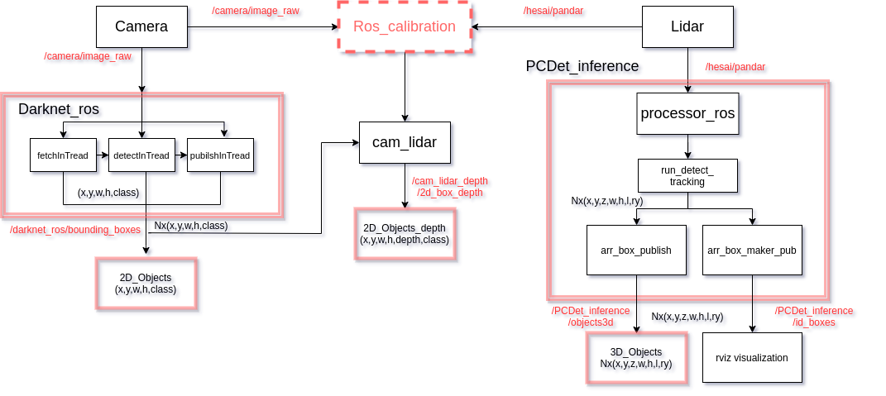

目标检测模块主要分为三个主模块，其数据输入来自摄像头和激光雷达，且包含两者传感器之间的标定。图中红色部分为目标检测在Ros中的节点和订阅发布的话题名称。
主要节点为Darknet_ros，用于摄像头的目标检测，从/camera/image_raw读入图像并通过话题/darknet_ros/bounding_boxes发布二维目标信息；
PCDet_ros用于激光雷达的目标检测，从话题/hesai/poandar读入激光雷达数据，通过/PCDet_inference/objects3d发布检测到的3D目标信息；
另外，中间cam_lidar模块主要用于将darknet_ros检测得到的2D目标通过投影的方式得到其在点云中的深度信息，并通过/cam_lidar_depth/2d_box_depth发布消息。

calibration_camera_lidar主要用于摄像头和激光雷达的标定，标定流程参见对应文件下的标定过程记录文档；
darknet_ros为基于摄像头的目标检测，具体安装和运行过程参见文件夹darknet_ros/darknet_ros下的readme；
PCDet_inference为基于激光雷达的目标检测，具体安装和运行过程参见文件夹下的readme；
HesaiLidar_General_ROS为激光雷达数据在ros上的节点；
kitti_visual文件夹为kitti数据集的使用发布，发布图像数据，激光雷达数据，用于PCDet_inference的测试，后期可直接接入激光雷达进行现实场景的目标检测，需要修改PCDet_inference中订阅的话题名称。
