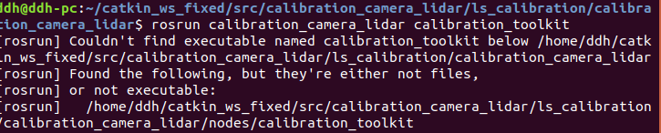
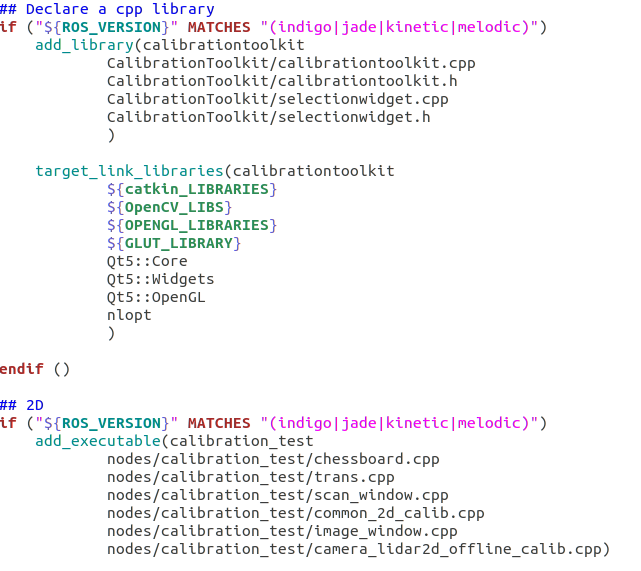

标定过程记录
采用AUTOWARE的标定工具包calibration_toolkit进行标定，不用安装autoware，直接编译工具包即可。
进入此链接：https://codechina.csdn.net/mirrors/XidianLemon/calibration_camera_lidar/-/tree/master/ls_calibration
1.编译标定工具箱依赖于nlopt，命令行输入sudo apt remove libnlopt-dev进行安装
2.安装jsk-recognition-msgs
命令行输入sudo apt-get install ros-melodic-jsk-recognition-msgs进行安装
3.rosrun calibration_camera_lidar calibration_toolkit

rosrun可能遇到如下问题：

需要对calibration_camera_lidar功能包下的CMakeLists.txt进行修改，添加ROS的melodic版本的支持，如下图所示，修改CMakeLists.txt中所有 (" R O S V E R S I O N " M A T C H E S " ( i n d i g o ∣ j a d e ∣ k i n e t i c ) " ) 为 ( " {ROS_VERSION}" MATCHES "(indigo|jade|kinetic)")为(" ROSV​ERSION"MATCHES"(indigo∣jade∣kinetic)")为("{ROS_VERSION}" MATCHES “(indigo|jade|kinetic|melodic)”)

此时启动rosrun calibration_camera_lidar calibration_toolkit不再出错。
具体流程参考如下过程：
https://blog.csdn.net/yourgreatfather/article/details/88245566
https://blog.csdn.net/zbr794866300/article/details/107144682/?utm_medium=distribute.pc_relevant.none-task-blog-baidujs_title-0&spm=1001.2101.3001.4242

完成安装之后启动对应的话题，并准备好标定板，准备录制rosbag包。
1.通过rosbag record -0 path/filename.bag topic1 topic2录制标定需要的rosbag包。
2.通过rosbag  play播放，按空格键停止。
3.启动标定节点rosrun calibration_camera_lidar calibration_toolkit，根据上述参考进行标定。
